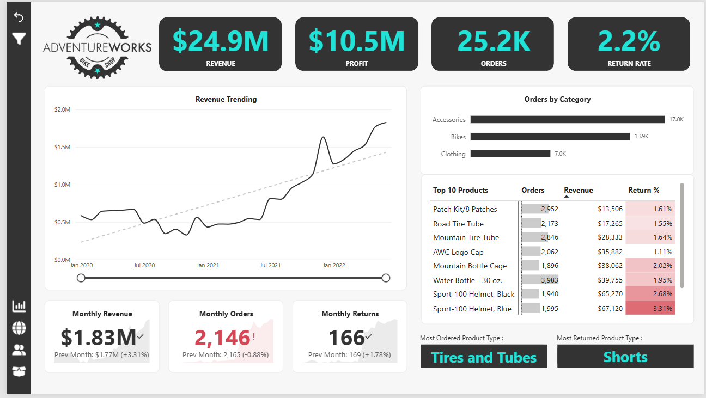

# PowerBI-Business-Intelligence-Dashboard 📈

A Power BI dashboard built on the AdventureWorks dataset to analyze sales performance, customer behavior, product trends, and regional performance.
The report combines executive KPI monitoring, interactive drill-down analysis, AI-powered insights, and sales forecasting to support data-driven decision making.

---

## Business Problem 🚨

AdventureWorks management requires a centralized reporting solution to monitor sales performance, customer behavior, product profitability, and regional trends.
The objective of this dashboard is to provide actionable insights that help stakeholders:
- Track revenue and profitability
- Identify top-performing products
- Analyze customer purchasing behavior
- Monitor regional sales performance
- Forecast future sales trends

---

## Tech Stack 📌

**Power BI, DAX, Power Query, Data Modeling**

---

## What I Built 🔧

This dashboard consists of multiple report pages covering:

- Executive Sales Overview
- Customer Analysis
- Product Performance
- Geographic Sales Analysis
- Sales Performance Insights
- AI Insights (Key Influencers, Decomposition Tree & Anomaly Detection)

---

## Key Metrics Tracked ✅

- Total Revenue
- Total Orders
- Total Profit
- Average Order Value
- Customer Retention Rate
- Sales Growth %
- Regional Performance
- Product Category Performance

---

## Dashboard Features 🚀

- Interactive slicers and filters
- Drill-through analysis
- Dynamic KPI cards
- Time-series forecasting
- AI-powered Key Influencers analysis
- Decomposition Tree analysis
- Anomaly Detection
- Geographic mapping

---

## Preview 📱



---

## 📂 Repository Structure
```
PowerBI-Business-Intelligence-Dashboard/
│
├── custom-icons/                           # PNG files for custom icon images used in the dashboard
├── dashboard-screenshots/                  # Dashboard screenshots for all important analysis
├── datasets/                               # Raw datasets used for the project (AdventureWorks Raw Data)
├── AdventureWorks_Report-Dashboard.pbix    # Main Dashboard File (PowerBI)
├── demo.mp4                                # demo mp4 screen recording to showcase the dashboard features
│
├── README.md                               # Project overview and instructions
├── LICENSE                                 # License information for the repository
```

---

## 🌟 About Me

Hi, I'm **Akarsh Kapoor** — a Data & Analytics professional passionate about solving business problems through technology, automation, and data-driven insights.
My interests include:

- Data Analytics & Business Intelligence
- SQL & Database Management
- Python Automation
- Cloud Technologies (AWS)
- AI & Data-Driven Solutions

Let's connect!

[](https://www.linkedin.com/in/akarsh-kapoor/)
